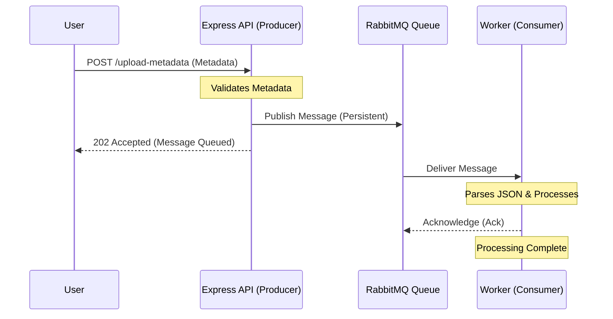

# Node.js RabbitMQ File Upload Metadata Sample

This project demonstrates a simple RabbitMQ implementation using Node.js and TypeScript. It follows the **Producer-Consumer** pattern to handle file upload metadata asynchronously.

## Workflow Diagram



## How It Works

1.  **Producer (Express Server)**:
    -   Listens on port `3000`.
    -   Exposes an endpoint `POST /upload-metadata`.
    -   When it receives metadata, it validates the fields and pushes the data onto a RabbitMQ queue named `file_metadata_queue`.
    -   The producer returns an immediate `202 Accepted` response, ensuring the user doesn't wait for processing.

2.  **RabbitMQ (Message Broker)**:
    -   Acts as a buffer between the API and the worker.
    -   Ensures messages are persistent (stored on disk) so they aren't lost if the server restarts.

3.  **Consumer (Background Worker)**:
    -   Connects to the same `file_metadata_queue`.
    -   Consumes messages one by one.
    -   Simulates processing (e.g., database entry, thumbnail generation) and acknowledges the message once done.

## Prerequisites

-   [Node.js](https://nodejs.org/) (v16+)
-   [Docker Desktop](https://www.docker.com/products/docker-desktop/)

## Getting Started

### 1. Setup Environment
Clone the repository and install dependencies:
```bash
npm install
```

### 2. Start RabbitMQ
Run the RabbitMQ server using Docker Compose from the root of the project directory:
```bash
docker-compose up -d
```
> You can access the RabbitMQ Management UI at [http://localhost:15672](http://localhost:15672) (User/Pass: `guest`/`guest`).

### 3. Run the Application
Open two separate terminals:

**Terminal 1 (Consumer):**
```bash
npm run start:consumer
```

**Terminal 2 (Producer):**
```bash
npm run start:producer
```

### 4. Test the API
Send a sample metadata request using PowerShell:
```powershell
Invoke-RestMethod -Uri http://localhost:3000/upload-metadata -Method Post -Body (@{ filename="vacation_photo.jpg"; size=2048576; type="image/jpeg"; uploader="mark_wayne" } | ConvertTo-Json) -ContentType "application/json"
```

## Project Structure

- `src/producer.ts`: Express server that publishes messages to RabbitMQ.
- `src/consumer.ts`: Background worker that consumes and processes messages.
- `docker-compose.yml`: RabbitMQ service configuration.
- `test_request.ps1`: Helper script for testing the API.

---

## Why use RabbitMQ for File Uploads?

### RabbitMQ vs. Direct Processing
In a **Direct Processing** model, the server handles everything (upload, validation, database entry, thumbnail generation) before sending a response to the user.
- **Problem**: Large files or heavy processing (like video transcoding) cause high latency. If the server crashes during processing, the job is lost.
- **RabbitMQ Solution**: The server only handles the "receipt" of the upload and immediately hands off the task to a queue. This **decouples** the API from the heavy lifting, providing a faster user experience and better reliability.

### RabbitMQ vs. Kafka
Both are powerful, but they serve different purposes:

| Feature | RabbitMQ (Message Broker) | Apache Kafka (Event Streaming) |
| :--- | :--- | :--- |
| **Primary Goal** | Delivering messages to consumers as fast as possible. | Storing streams of events for long-term replay. |
| **Complexity** | Lightweight and easy to set up (Smart Broker/Dumb Consumer). | More complex setup (Dumb Broker/Smart Consumer). |
| **Ordering** | Guaranteed within a queue. | Guaranteed within a partition. |
| **Usecase** | **Best for task queues**, background jobs, and microservice communication. | Best for log aggregation, real-time analytics, and big data. |

**Summary**: For a file upload scenario where you just need to ensure a background task (like processing metadata or generating a thumbnail) gets done, **RabbitMQ** is usually the simpler and more appropriate choice. Kafka is overkill unless you need to replay those upload events multiple times for different analytics engines.
